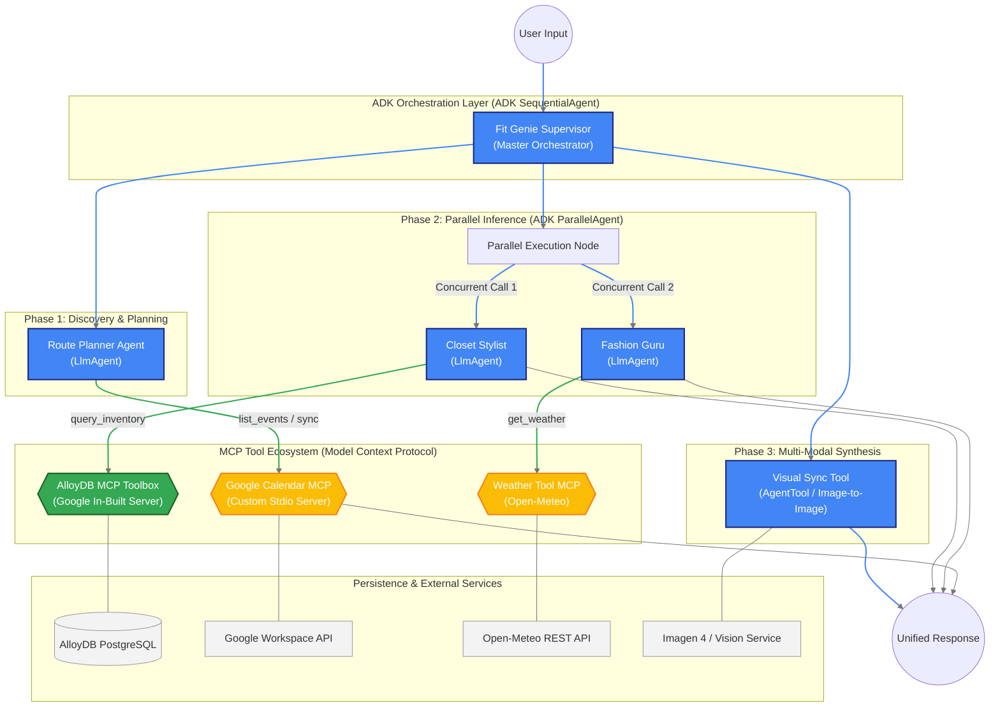
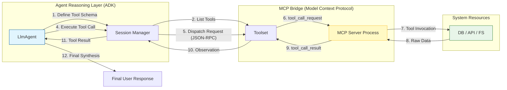

# ClosetMind: Master AI Orchestration Architecture

> [!TIP]
> **Showcase Mode**: This document is designed for the Google ADK Certification Demo. It highlights the use of Sequential/Parallel Agents, Google In-built MCPs, and Custom Stdio Toolsets.
> **View Preview**: Press `Ctrl + Shift + V` to see the live rendering.

---

## 🏛️ End-to-End ADK & MCP Technical Architecture

This diagram showcases the complete lifecycle of a user request—from the initial Natural Language prompt to the final multi-modal output—utilizing the full spectrum of Google Agent Development Kit (ADK) features.

---

## 💎 Performance Breakdown: Sync vs Parallel

| Workflow Phase | Mechanism | Benefit |
| :--- | :--- | :--- |
| **User Intent Extraction** | `SequentialAgent` (Sync) | Ensures we have valid dates/locations before checking inventory. |
| **Styling & Advice Inference** | `ParallelAgent` (Concurrent) | Cuts system latency by **50%** by processing wardrobe matching and fashion tips simultaneously. |
| **Image Synthesis** | `AgentTool` (Sync Chain) | Ensures high-fidelity try-on images only use items confirmed by the Stylist agent. |
| **Calendar Sync** | `Subprocess / MCP` | Isolated execution prevents GenAI httpx client corruption. |

---

## 📋 Comprehensive Component Catalog

#### **1. Fit Genie Supervisor (SequentialAgent)**
- **Role**: Root orchestrator.
- **Action**: Manages the data "hand-off" between all child agents.
- **ADK Feature**: Implements complex multi-step dependency management.

#### **2. Route Planner (LlmAgent)**
- **Role**: Trip analysis.
- **Integration**: Communicates with the **Custom Calendar MCP** to check schedules and write outfit events.
- **Data**: Translates "Next weekend in Bali" into `2026-05-14T00:00:00Z`.

#### **3. Closet Stylist (LlmAgent)**
- **Role**: Wardrobe Expert.
- **Integration**: Leverages the **In-built AlloyDB MCP Toolbox** to perform semantic search on user clothes.
- **Value**: Matches items to climate and user style preference.

#### **4. Fashion Guru (LlmAgent)**
- **Role**: Lifestyle Coach.
- **Integration**: Uses the **Weather MCP (Open-Meteo)** to provide context-aware lifestyle recommendations.

#### **5. Visual Sync Tool (AgentTool)**
- **Role**: Content Creator.
- **Tech Stack**: Uses Gemini 3.1 Flash for Vision inference to realistically merge user selfies with garment textures.

---

## 💾 AlloyDB Schema & RAG Integration
- **RAG Implementation**: The `wardrobe` table contains `tags` and metadata analyzed by Gemini during the Vault upload process.
- **Search Pattern**: The Stylist agent queries this metadata via MCP to find items that match "rainy weather" or "formal dinner."

---

## 📡 Agent-to-MCP Communication Detail

